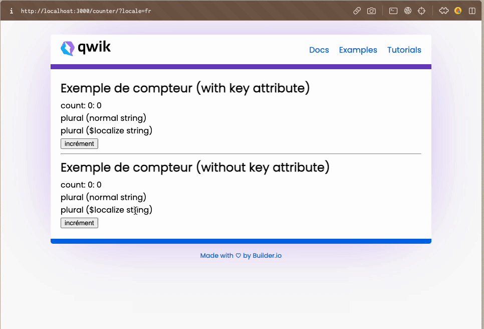

# $localize issue with Qwik

$localize is not translating properly when used in a ternary that depends on a value from a store or when using a store value in it's template literal.

run
```bash
npm run build.client && npm run build.server && npm run i18n-translate && npm run serve
```
and open http://localhost:3000/counter/?locale=fr

see [src/components/counter.tsx](src/components/counter.tsx) for code




# i18n demo for Qwik

Qwik is unique in that it has fine-grained lazy loading of code. The classical way to do translation is at runtime by looking up the translation strings in the translation map. This is not conducive with lazy loading because it requires that the translations be eagerly loaded, defeating the fine-grained lazy loading of Qwik.

## Overview

There are two ways to do translation:

1. **Runtime**: Translation is performed at runtime by looking up the translation strings in the translation map.
   - PROS:
     - No build step.
     - Easy way to test the application in development.
   - CONS:
     - Translations strings must be eagerly loaded.
     - Each string is in triplicate. 1) original string, 2) translation string, 3) key to lookup translation string.
2. **Compile time**: Translation is performed as part of the build step.
   - PROS:
     - Translated strings are inlined into the application. No need to load or look them up at runtime.
     - Because the strings are inlined, they can be lazy-loaded with application code.
   - CONS:
     - Requires a build step.
     - User can't change the language without a page refresh. (Or have mixed languages on the same page.)

We think that the best approach is to use a hybrid approach.

1. During development, use runtime translation to make the development easy, and not require extra build steps.
2. During production use:
   - compile time translation for code sent to the browser. It is important for the user experience to be fast only the compile-time approach can provide the best user experience.
   - runtime translation for server code. Because lazy loading is not of concern on the server, a simpler runtime approach is used. This results in a single binary that needs to be deployed to the server.

## `$localize` (by Angular)

The translation system is based on the `$localize` system from [Angular](https://angular.io/api/localize/init/$localize). The translations can be extracted in `xmb`, `xlf`, `xlif`, `xliff`, `xlf2`, `xlif2`, `xliff2`, and `json` formats.

> NOTE: The `$localize` system is a compile-time translation system and is completely removed from the final output. `$localize` is a sub-project of Angular, and including its usage does not mean that Angular is used for rendering of applications.

### Marking string for translation

Any string can be marked for translation by using the `$localize` template function like so:

```typescript
export default component$((props: { name: string }) => {
  return <span>{$localize`Hello ${props.name}!`}</span>;
});
```

### Extracting string for translation

The first step in translation is to build the application. Once the artifacts are build the the strings can be extracted for translation.

```bash
npm run build.client
npm run i18n-extract
```

The result of the commands is `src/locale/message.en.json`.

### Translating strings

Take the resulting string and send them for translation. Produce a file for each language. For example:

```bash
src/locale/message.en.json    # Original strings
src/locale/message.fr.json
src/locale/message.sp.json
```

### Inline strings

The strings need to be inlined into the application. This is done by running the following command:

```bash
npm run i18n-translate
```

The result of this command is that the browser chunks are generated once for each locale. For example:

```bash
dist/builld/q-*.js  # Original chunks
dist/builld/en/q-*.js
dist/builld/fr/q-*.js
dist/builld/sp/q-*.js
```

## Development mode

```bash
npm run dev
```

Navigate to `http://localhost:5173`. The resulting language should match your browser language. You can also override the language by adding `?lang=sk` to the URL.

## Building the application

Here are the steps to build the application for production.

```
npm run build.client && npm run build.server && npm run i18n-translate && npm run serve
```

---

# Qwik App ⚡️

- [Qwik Docs](https://qwik.builder.io/)
- [Discord](https://qwik.builder.io/chat)
- [Qwik Github](https://github.com/BuilderIO/qwik)
- [@QwikDev](https://twitter.com/QwikDev)
- [Vite](https://vitejs.dev/)
- [Partytown](https://partytown.builder.io/)
- [Mitosis](https://github.com/BuilderIO/mitosis)
- [Builder.io](https://www.builder.io/)

---

## Project Structure

Inside of you project, you'll see the following directories and files:

```

├── public/
│ └── ...
└── src/
├── components/
│ └── ...
└── routes/
└── ...

```

- `src/routes`: Provides the directory based routing, which can include a hierarchy of `layout.tsx` layout files, and `index.tsx` files as the page. Additionally, `index.ts` files are endpoints. Please see the [routing docs](https://qwik.builder.io/qwikcity/routing/overview/) for more info.

- `src/components`: Recommended directory for components.

- `public`: Any static assets, like images, can be placed in the public directory. Please see the [Vite public directory](https://vitejs.dev/guide/assets.html#the-public-directory) for more info.

## Add Integrations

Use the `npm run qwik add` command to add other integrations. Some examples of integrations include as a Cloudflare, Netlify or Vercel server, and the Static Site Generator (SSG).

```

npm run qwik add

```

## Development

Development mode uses [Vite's development server](https://vitejs.dev/). For Qwik during development, the `dev` command will also server-side render (SSR) the output. The client-side development modules loaded by the browser.

```

npm run dev

```

> Note: during dev mode, Vite will request many JS files, which does not represent a Qwik production build.

## Preview

The preview command will create a production build of the client modules, production build of `src/entry.preview.tsx`, and create a local server. The preview server is only for convenience to locally preview a production build, but it should not be used as a production server.

```

npm run preview

```

## Production

The production build should generate the client and server modules by running both client and server build commands. Additionally, the build command will use Typescript run a type check on the source.

```

npm run build

```

## Express Server

This app has a minimal [Express server](https://expressjs.com/) implementation. After running a full build, you can preview the build using the command:

```

npm run serve

```

Then visit [http://localhost:8080/](http://localhost:8080/)

```

```

```

```
